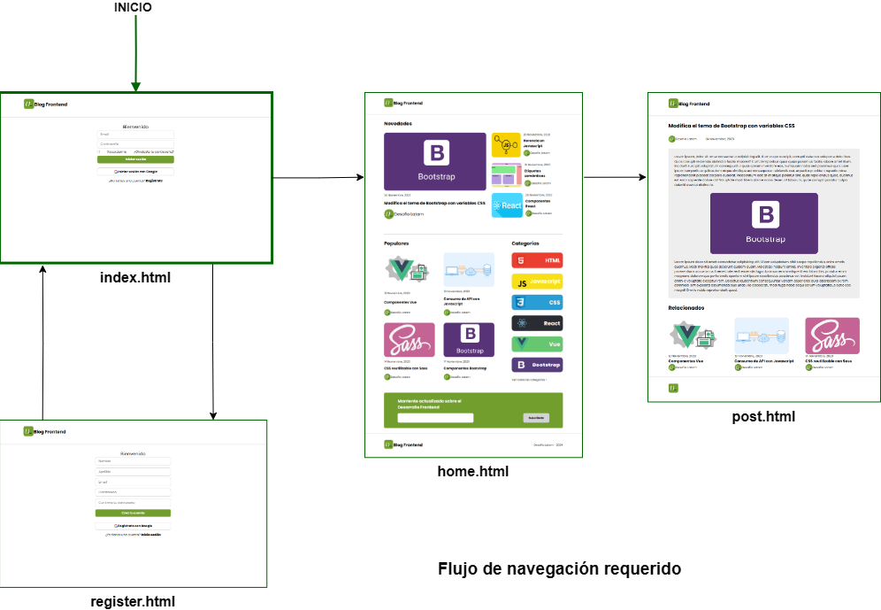

- [Desafío Blog Frontend II](#desafío-blog-frontend-ii)
  - [Skills fundamentales](#skills-fundamentales)
  - [Consideraciones](#consideraciones)
  - [Utilizando Sass](#utilizando-sass)
    - [Instalar Sass](#instalar-sass)
    - [Usando Sass](#usando-sass)
  - [Flujo de navegación del proyecto](#flujo-de-navegación-del-proyecto)
  - [Consideraciones de implementación de layout](#consideraciones-de-implementación-de-layout)

# Desafío Blog Frontend II

## Skills fundamentales

1. [Usar Sass](#utilizando-sass) y el patrón arquitéctonico 7-1 para organizar los estilos del proyecto. Requiere: 
   1. Instalar Sass
   2. Crear la estructura de carpetas y archivos necesarios (patrón 7-1)
   3. Ejecutar sass desde la consola para compilar todos los archivos en una única hoja de estilo
2. Crear un flujo de navegación entre varias vistas de un sitio web. Requiere:
   1. Crear las vistas.
   2. Realizar los enlaces correspondientes.

## Consideraciones

- Este ejercicio no presenta una maqueta así que hay que orientarse por las imágenes que se presentan en el propio [desafio](./assets/util/desafio.pdf)
- Este ejercicio necesita que tengas implementado el login realizado en un ejercicio guiado dos clases antes de la correspondiente a este desafío.

## Utilizando Sass

[Sass](https://sass-lang.com) es una herramienta que tiene muchas utilidades para incrementar enormemente el flujo de trabajo con CSS. En el bootcamp en particular solo se utilizará para implementar el [patrón de arquitectura 7-1](https://sass-guidelin.es/#architecture) porque este ya es una gran ayuda a la hora de organizar una gran cantidad de estilos css en diferentes archivos bajo nombres que son fáciles de asociar a un contenido en particular y que luego se convierten en una sola gran hoja de estilos de forma automática utilizando un comando de Sass.  

Para utilizarlo debemos instalar Sass: 

### Instalar Sass

Este es un proceso que se realiza globalmente para poder utilizarlo frecuentemente aunque también es posible instalarlo de forma local a un proyecto en específico. El material del curso lo instala de forma global utilizando el flag -g de la siguiente manera. Copia en tu terminal:

`npm install -g sass`

luego de instalado, puedes probar la versión utilizando el comando: 

`sass --version`

**OBS:** Si al intentar instalar en un Mac la terminal responde con un error de autorización deben usar el comando de la siguiente manera: 

`sudo npm install -g sass`

Este comando lanzará un prompt a la terminal para ingresar la clave de usuario y poder completar la operación.

Si la instalación fue correcta, ya estás listo para usar Sass. 

### Usando Sass

Para aplicarlo en este proyecto es necesario que implementes el patrón 7-1, que consiste en crear 7 carpetas y 1 archivo en alguna ubicación del proyecto. Siguiente el contenido del curso, se creará una nueva carpeta `assets/sass` y dentro de esta se crearán las 7 carpetas y el archivo. La estructura es similar a esta: 

```
/assets/sass/abstracts
            /base
            /components
            /layout
            /pages
            /themes
            /vendors
            /main.scss
```

En esta estructura los directorios aparecen en forma alfabética porque es como los presentará el browser sin importar cuál creemos primero, pero un aspecto fundamental para que nuestros estilos funcionen es que importemos los archivos parciales que crearemos dentro de estas 7 carpetas en un orden específico para que los estilos no se anulen de maneras inesperadas o contrarias a lo que necesitamos. El orden en que importaremos los archivos de las carpetas es este: 

```
@import 'abstracts/*';
@import 'vendors/*';
@import 'base/*';
@import 'layout/*';
@import 'components/*';
@import 'pages/*';
@import 'themes/*';
```

Mira el archivo [main.scss](./assets/sass/main.scss) para observar la implementación sugerida para este desafío en particular.

Una vez creadas las carpetas y el archivo `main.scss` podemos comenzar a escribir los estilos css dentro de archjvos "parciales" que tienen 2 características importantes: 

- Solo se usan para ser importados en `main.scss`
- Deben comenzar con un guión bajo para que Sass "entienda" que son parciales.
- En el archivo `main.scss` no es necesario que se incluya ni el guión bajo ni la extensión del archivo.

Entonces luego de escribir tus primeros archivos parciales y escribir su nombre en `main.scss` para importarlos, puedes ejecutar el comando que compila estos archivos y los transforma en un solo archivo style.css en assets/css:

`sass --watch assets/sass/main.scss:assets/css/style.css`

El comando literalmente podría leerse como la siguiente orden: 

"Sass: vigila constantemente mi archivo assets/sass/mains.scss y transforma todo lo que importes en ese archivo en una sola hoja de estilos que llamarás assets/css/style.css"

Una consideración importante es que Sass solo escribe un nuevo archivo style.css pero no puede sobre escribir uno existente, por lo que si ya creaste el archivo style.css antes de compilar con sass, debes cambiarle el nombre, porque de lo contrario generará un error.  

Si no da errores, podrás ver que en tu carpeta `assets/css` aparecerán dos archivos nuevos: `style.css` y `style.css.map`. No toques ni manipules el contenido de este archivo map que es que el utiliza Sass para llevar un control de los archivos compilados.


## Flujo de navegación del proyecto

El otro skill que vale puntos en este desafío es implementar un flujo de navegación entre varias vistas. Los requerimientos 3 y 4 de la pauta sugieren el modelo de navegación presentado al usuario:

- Partiremos en el login creado junto al relator un par de clases antes de la del ejercicio
- En el login, al dar clic en el botón iniciar sesión debe navegar a la página principal. (desafio anterior)
- En el login, al dar clic a registrar cuenta, debe navegar a la vista de registro.
- En el registro, al dar clic al botón de crear cuenta, debe navegar a la página de login. 
- En la página principal, al dar clic en el post principal debe navegar a la vista del post.

Adicionalmente, en la página del post se puede volver a navegar a la página principal. Este diagrama ilustra la relación de navegación de las vistas.



En este ejemplo de implementación se ha utilizado el elemento \<a>\</a> para los enlaces de navegación excepto en la vista principal en que para mejorar la experiencia de usuario, se ha creado un listener en toda la card del post para que sin importar en qué parte del post se haga clic la navegación se produzca de forma exitosa.

Pueden encontrar las implementaciones en: 
- [del login al registro](./index.html#L40)
- [del login al home](./index.html#L37)
- [del home al post](./home.html#L235)
- [del post al home](./post.html#L18)

## Consideraciones de implementación de layout

Aunque el desafío anterior y este no imponen formas de hacer layout por lo que puedes hacerlo con Bootstrap sin problema, esta implementación utiliza css flexbox para separar los nombres de clase BEM de los aspectos presentacionales. Solo se utilizan cuando son necesarios wrappers o containers para establecer `containers flexbox` y así poder aplicar estos estilos a los elementos que queremos organizar. Como el desafío no va de este tema no presentaré más información pero si quieres investigar por tí mismo puedes usar la guía de Flexbox de MDN en inglés o español [acá](https://developer.mozilla.org/en-US/docs/Learn/CSS/CSS_layout/Flexbox). Como un tip te puedo invitar a aprenderlo, porque es una manera de hacer layout que no involucra más de unas 15 propiedades, pero ya conocer unas pocas puedes hacer cosas muy interesantes. Las primeras propiedades sugeridas de aprender son:

1. [display: flex](https://developer.mozilla.org/en-US/docs/Web/CSS/display)
2. [flex-direction](https://developer.mozilla.org/en-US/docs/Web/CSS/flex-direction)
3. [justify-content](https://developer.mozilla.org/en-US/docs/Web/CSS/justify-content)
4. [align-items](https://developer.mozilla.org/en-US/docs/Web/CSS/align-items)
5. [flex-wrap](https://developer.mozilla.org/en-US/docs/Web/CSS/flex-wrap)